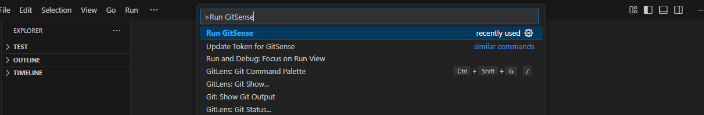
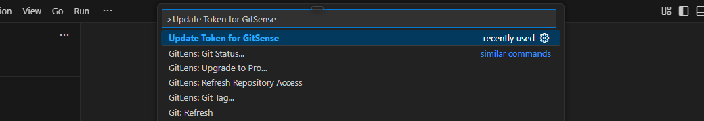

# GitSense - Automate Your GitHub Contributions

GitSense is a VS Code extension that automates the process of summarizing your coding activity and committing it to a GitHub repository. It monitors your coding activity in one-hour intervals, generates a summary of your changes, and commits and pushes these summaries to your GitHub repository named `GitSense-commits`. This tool streamlines tracking your progress and maintaining a detailed log of your work.

---

## Why GitSense?

In many professional workflows, developers often work on feature branches and make commits. However, when these branches are merged, the commit history becomes condensed, and the individual contributions are not reflected. Additionally, many developers use separate email accounts for professional work, leaving little time to enhance their personal GitHub profiles.

GitSense addresses this gap by ensuring your personal GitHub profile stays active and well-maintained. It automatically updates your GitHub commit chart with regular commits, helping you showcase consistent activity and growth as a developer.

---

## Features

1. **Automated Monitoring**: GitSense monitors the codes you save and generates summaries of your code every hour.
2. **Hourly Commits**: After an hour of work, GitSense commits and pushes a summary of your changes to the `GitSense-commits` repository.
   - For example, if you work for 2 hours, there will be 2 commits and pushes.
3. **GitHub Integration**:
   - Login via VS Code to authenticate with your GitHub account.
   - Alternatively, you can manually enter your GitHub Personal Access Token (PAT) for authentication.
4. **Enhance Your GitHub Profile**: Maintain a consistent and active commit chart on your personal GitHub profile, even when working on professional projects.
5. **Flexible Commands**:
   - Activate GitSense with the `Run GitSense` command.
   - Update your PAT manually with the `Update Token` command.

---

## Installation

1. Install GitSense from the VS Code marketplace. [Link to the extension]( " ").
2. Open VS Code and run `Run GitSense` using the command palette (`Ctrl + Shift + P` or `Cmd + Shift + P` on macOS) to run the extension.

---

## Getting Started

### Step 1: Authenticate with GitHub
GitSense requires access to your GitHub account to push commits. You can authenticate in one of the following ways:

#### **Option 1: Login via VS Code**
1. Open the command palette (`Ctrl + Shift + P` or `Cmd + Shift + P`).
2. Select the `Run GitSense` command.
3. If you are already logged into GitHub through VS Code, GitSense will start working immediately.
4. If not, you will be prompted to login via GitHub. ([image](images/runGitsense.png))

#### **Option 2: Use a Personal Access Token (PAT)**
1. Generate a Personal Access Token by following [this guide](https://docs.github.com/en/authentication/keeping-your-account-and-data-secure/managing-your-personal-access-tokens).
   - Ensure the token has `repo` access.
   - Example setup: ([image](images/setPAT4.png)).
2. Open the command palette (`Ctrl + Shift + P` or `Cmd + Shift + P`).
3. Run `Update Token for GitSense` and enter your PAT in the input box. (See [image](images/updateToken.png))

---

## How It Works
1. GitSense monitors your saved changes every hour.
2. At the end of each hour, it generates a summary of your work.
3. The summary is committed and pushed to your `GitSense-commits` repository.
   - If you work for 2 hours, GitSense will create 2 commits and pushes.
4. By ensuring regular commits, GitSense helps you maintain an active GitHub profile, even when your professional projects involve complex workflows with merged commits or separate email accounts.

---

## Commands

### 1. **Run GitSense**
- Activate GitSense to start monitoring your code.
- Command: `Run GitSense`
- Shortcut: `Ctrl + Shift + P` or `Cmd + Shift + P`, then type `Run GitSense`.
([image](images\runGitsense.png))

### 2. **Update Token for GitSense**
- Update your Personal Access Token (PAT) for GitHub authentication.
- Command: `Update Token for GitSense`
- Shortcut: `Ctrl + Shift + P` or `Cmd + Shift + P`, then type `Update Token`.
([image](images\updateToken.png))

---

## Requirements
- **VS Code**: Make sure you have VS Code installed.
- **GitHub Account**: Required for authentication.
- **Personal Access Token (Optional)**: If not using the login feature.
- **Repository Name**: The extension automatically creates and commits to a repository named `GitSense-commits`.

---

## Screenshots

### Login Prompt:

### Update Personal Access Token:

---

## About the Creator
GitSense is created and maintained by **KAMAL-02**. Feel free to reach out.

---

## License
GitSense is licensed under the MIT License. See the `LICENSE` file for details.

